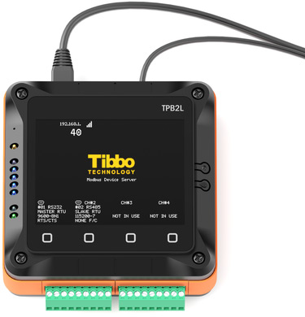

# Modbus Gateway (MG) Application

This application turns our second-generation [TPS devices](http://tibbo.com/store/tps/standard.html) and [DS1101](http://tibbo.com/store/controllers/ds1101.html)/[DS1102](http://tibbo.com/store/controllers/ds1102.html) controllers into full-featured Modbus Gateways. Modbus Gateways seamlessly route Modbus requests and replies between Modbus TCP, Modbus ASCII, and Modbus RTU masters and slaves.

To achieve better performance, choose our ARM-based hardware ([TPP2(G2)](http://tibbo.com/store/tps/tpp2g2.html), [TPP3(G2)](http://tibbo.com/store/tps/tpp3g2.html), [EM2000](http://tibbo.com/store/modules/em2000.html)*).

For more information on this app and our Modbus Gateway solution, see the [Tibbo Modbus Gateways](http://tibbo.com/modbus-gateways.html) page.

This solution is also documented in the [Tibbo Modbus Gateway Manual (TMGM)](http://docs.tibbo.com/tmgm/).

** This device can run the app, but you will need to compile (build) it for the EM2000 by yourself.*

  
